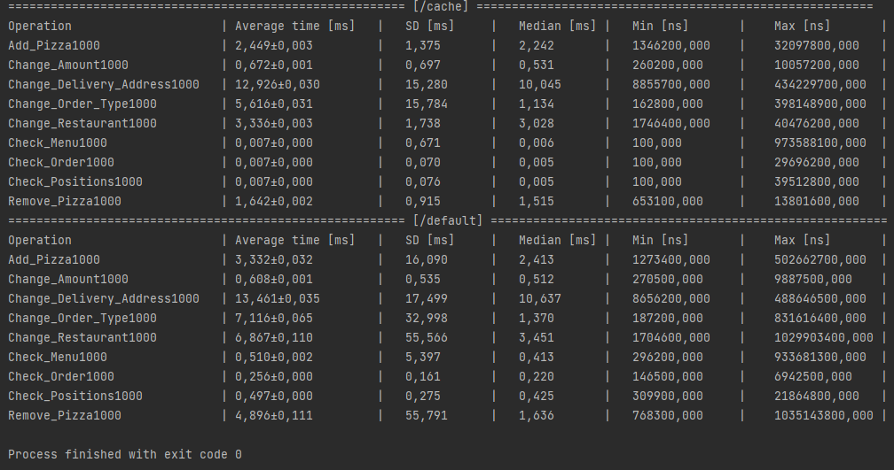

# Лабораторная работа 4: Кэширование

## Цели работы

Знакомство студентов с алгоритмами кэширования.
В рамках данной работы необходимо разработать кэширующий SQL-proxy - программу, которая принимала бы запросы к БД, отправляла эти запросы в БД, сохраняла бы результаты в хранилище. Если приходит повторный запрос на чтение - выдавала запросы из хранилища, если приходит запрос на изменение - сбрасывала бы значения всех запросов, результаты которых станут неактуальными после внесенных изменений.

## Программа работы

Общее описание:

1. для данной работы необходимо выбрать часть таблиц БД (3+), для которой можно придумать/использовать осмысленные SQL-запросы, необходимые для выполнения пользовательских функций
в рамках работы необходимо реализовать две программы: кэширующий прокси и программа для выполнения запросов и измерения результатов


2. Выбор понравившегося способа кэширования:
    - в памяти программы
    - с использованием внешних хранилищ
    - во внешней памяти


3. Реализация выбранного способа
    - преобразование входных запросов
    - выбор ключа для хранения результатов
    - реализация алгоритма поиска сохраненных результатов, которые надо сбросить после внесения изменений в БД


4. Снятие показательных характеристик

-   в программе для формирования потока запросов к БД на чтение/изменение/удаление должна быть возможность настройки соотношения запросов, количества запросов разных типов в потоке и измерения временных характеристик: среднее/минимальное/максимальное время выполнения запроса по типу, необходимо иметь возможность проанализировать эффективность кэширования в различных сценариев: преимущественно чтение, преимущественно изменение, преимущественно удаление
измерения можно производить путем простого сравнения отметок текущего времени до и после выполнения запросов

5. Анализ полученных результатов и сравнение реализаций с кэшем и без между собой.
6. Демонстрация результатов преподавателю.

## Ход работы:

### **Выбор области запросов и кэширования**

Для данной работы я решил моделировать следующий тип взаимодействия с БД: оформление онлайн заказов пиццы. У посетителя есть список пицц, корзина, и статус его заказа. В основном работа будет происходить с этими таблицами.

Что нам нужно:
- Таблица с информацией о заказе (`order`)
- Таблица с позициями в заказе (`pizza_in_order`)
- Таблица с доставкой (`delivery`)

Какие функции будут у нашего API:
- Посмотреть меню заведений (добавил для теста)
- Посмотреть информацию о заказе (включая доставку)
- Посмотреть из чего состоит заказ
- Добавить пиццу к заказу
- Изменить количество пицц в заказе
- Изменить тип заказа (имеется ввиду доставка/самовывоз)
- Изменить ресторан доставки/самовывоза
- Изменить адрес доставки
- Удалить пиццу из заказа


Кэширование будет происходить в памяти JVM, как алгоритм я использую самый простой LRU.

### **Изменение схемы БД**

В прошлых работах обсуждалось, что заказ не может меняться и поэтому триггер стоял только на добавление позиций. Теперь всё иначе, поэтому я сделал следующую функцию, что позволило изменять данные о заказе, без особых трудностей:

```sql
CREATE OR REPLACE FUNCTION recalc_order(target_id int) RETURNS numeric(10, 2)
AS
$recalc_pizza$
BEGIN
    RETURN (
        SELECT SUM(p.pizza_price * pio.amount)
        FROM "order" o
                 JOIN public.pizza_in_order pio ON o.order_id = pio.order_id
                 JOIN pizza p ON pio.pizza_id = p.pizza_id
        WHERE o.order_id = target_id
    );
END;

$recalc_pizza$ LANGUAGE plpgsql;
```

### **Алгоритм кэширования**

Перед началом работы с БД, надо написать класс кэширования и проверить его в действии:

```kotlin
open class LRU<Key, Value>(private val size: Int) {

    private val linkedQueue = ConcurrentLinkedQueue<Key>()
    private val hashMap = ConcurrentHashMap<Key, Value>()

    operator fun get(key: Key): Value? {
        val value = hashMap[key]
        if (value != null) {
            linkedQueue.remove(key)
            linkedQueue.add(key)
        }
        return value
    }

    @Synchronized
    operator fun set(key: Key, value: Value) {
        if (hashMap.contains(key)) {
            linkedQueue.remove(key)
        }

        while (linkedQueue.size >= size) {
            val oldestKey = linkedQueue.poll()
            if (oldestKey != null) {
                hashMap.remove(oldestKey)
            }
        }
        linkedQueue.add(key)
        hashMap[key] = value
    }

    @Synchronized
    fun remove(key: Key) {
        if (linkedQueue.contains(key)) {
            linkedQueue.remove(key)
            if (key != null) {
                hashMap.remove(key)
            }
        }

    }

    // For debug
    fun iterator() : MutableIterator<MutableMap.MutableEntry<Key, Value>> {
        return hashMap.iterator()
    }

    // For debug
    fun getInfo() : String{
        return hashMap.toString()
    }

}
```

Функция `get` выдаём нам информацию по запросу, если ключ в ассоциативном словаре присутсвует, то получаем данные, иначе `null`. Также при доступе к данным, надо перезаписать их в очередь, это нужно для организации LRU.

Функция `set` добавляет новые данные в словарь. В этой части также нужно позаботиться о используемой памяти кэша и очереди..

Функция `remove` будет использоваться для удаления неактуальной информации. Сам механизм перехвата данных будет реализован в специальном классе.

Перед началом работы с кэшем проверим его потокобезопасность на простом примере:

```kotlin
fun main(){
    val cyclicBarrier = CyclicBarrier(2)
    val a = AtomicInteger(0)

    val th1 = Thread {
        cyclicBarrier.await()
        var i = 0
        var j = 0

        for (x in 0..5){
            i = nextInt(5)
            j = nextInt(100)
            Cache[i] = j
            println("[${a.incrementAndGet()}]Added $i=$j,cache=${Cache.getInfo()} by ${Thread.currentThread()} ")
            i = nextInt(5)
            println("[${a.incrementAndGet()}]Get $i=${Cache[i]},cache=${Cache.getInfo()} by ${Thread.currentThread()} ")

        }

        cyclicBarrier.await()
        println(Cache.getInfo())
        cyclicBarrier.await()
    }
    val th2 = Thread {
        cyclicBarrier.await()
        var i = 0
        var j = 0
        for (x in 0..5){
            i = nextInt(4)
            j = nextInt(100)
            Cache[i] = j
            println("[${a.incrementAndGet()}]Added $i=$j,cache=${Cache.getInfo()} by ${Thread.currentThread()}")
            i = nextInt(5)
            println("[${a.incrementAndGet()}]Get $i=${Cache[i]},cache=${Cache.getInfo()} by ${Thread.currentThread()} ")
        }
        cyclicBarrier.await()
        cyclicBarrier.await()
    }
    th1.start()
    th2.start()
}
```

Вызываем 2 потока, которые будут работать с нашим кэшем. Также добавим переменную `AtomicInteger` для отслеживания порядка работы. Можно видеть, что потоки видят один и тот же кэш, и работают с ним правильно.

```
[1]Added 0=8,cache={0=8} by Thread[Thread-1,5,main]
[2]Added 0=8,cache={0=8} by Thread[Thread-0,5,main] 
[3]Get 1=null,cache={0=8} by Thread[Thread-1,5,main] 
[4]Get 3=null,cache={0=8} by Thread[Thread-0,5,main] 
[6]Added 2=64,cache={0=30, 2=64} by Thread[Thread-0,5,main] 
[5]Added 0=30,cache={0=30, 2=64} by Thread[Thread-1,5,main]
[7]Get 4=null,cache={0=30, 2=64} by Thread[Thread-0,5,main] 
[8]Get 1=null,cache={0=30, 2=64} by Thread[Thread-1,5,main] 
[9]Added 0=41,cache={0=41, 2=64} by Thread[Thread-0,5,main] 
[10]Get 1=null,cache={0=41, 2=64} by Thread[Thread-0,5,main] 
[11]Added 3=85,cache={2=64, 3=85} by Thread[Thread-1,5,main]
[12]Added 3=49,cache={2=64, 3=49} by Thread[Thread-0,5,main] 
[13]Get 0=null,cache={2=64, 3=49} by Thread[Thread-1,5,main] 
[14]Get 0=null,cache={2=64, 3=49} by Thread[Thread-0,5,main] 
[15]Added 0=92,cache={0=92, 2=64, 3=49} by Thread[Thread-1,5,main]
[16]Added 4=72,cache={0=92, 3=49, 4=72} by Thread[Thread-0,5,main] 
[17]Get 3=49,cache={0=92, 3=49, 4=72} by Thread[Thread-1,5,main] 
[19]Added 1=9,cache={1=9, 3=49, 4=72} by Thread[Thread-1,5,main]
[18]Get 4=72,cache={1=9, 3=49, 4=72} by Thread[Thread-0,5,main] 
[20]Get 2=null,cache={1=9, 3=49, 4=72} by Thread[Thread-1,5,main] 
[21]Added 1=21,cache={1=21, 4=72} by Thread[Thread-0,5,main] 
[22]Added 1=64,cache={1=64, 4=72} by Thread[Thread-1,5,main]
[23]Get 4=72,cache={1=64, 4=72} by Thread[Thread-0,5,main] 
[24]Get 4=72,cache={1=64, 4=72} by Thread[Thread-1,5,main] 
{1=64, 4=72}
```

Наглядно видно, что, например в 17 шаге, поток 2 получил данные внесённые потоком 1 в 12 шаге.

### **Связь с БД**

Т. к. для генерации данных я использовал Kotlin Exposed и мне понравился этот фреймворк, то и работу с БД буду производить через него. Для начала надо описать ключи для кэша. В качестве ключей, будем брать объект наследованный от `CacheKey` с уникальным идентификатором. На самом деле это очень простой вариант и выглядит он следующим образом:
```kotlin
abstract class CacheKey

class OrderKey(val orderId: Int) : CacheKey() {

    override fun hashCode(): Int {
        return orderId.hashCode()
    }

    override fun equals(other: Any?): Boolean {
        if (this === other) return true
        if (javaClass != other?.javaClass) return false

        other as OrderKey

        if (orderId != other.orderId) return false

        return true
    }
}
```
Т.к. у нас есть 2 варианта работы с БД: без кэширования и с кэшированием, то создадим два объекта, которые будут наследоваться от абстрактного класса:
```kotlin
package com.wooftown.caching

import com.wooftown.database.tables.ORDERTYPE
import org.jetbrains.exposed.sql.ResultRow

abstract class DatabaseConnector {

    abstract fun checkMenu(): List<ResultRow>?

    abstract fun checkOrderPositions(orderId: Int): List<ResultRow>?

    abstract fun checkOrder(orderId: Int): List<ResultRow>?

    abstract fun addPizza(orderId: Int, pizzaId: Int, amount: Int)

    abstract fun changePizzaAmount(orderId: Int, pizzaId: Int, newAmount: Int)

    abstract fun changeType(orderId: Int, newType: ORDERTYPE)

    abstract fun changeRestaurant(orderId: Int, newRestaurantId: Int)

    abstract fun changeDeliveryAddress(orderId: Int, newAddress: String)

    abstract fun removePizza(orderId: Int, pizzaId: Int)

}
```
Данный класс содержит все необходимые функции. Давайте посмотрим, как будут выглядеть методы работы с БД параллельно. Сверху - обычное взаимодействие с БД, снизу - кэширование.

- Посмотреть меню заведений (добавил для теста)
```kotlin
 override fun checkMenu(): List<ResultRow> {
        return transaction {
            Pizza.selectAll().map { it }
        }
    }

override fun checkMenu(): List<ResultRow>? {
        if (cachingEnabled) {
            val key = MenuKey
            if (Cache[key] != null) {
                return Cache[key]!!
            } else {
                val result = UsualDatabaseConnector.checkMenu()
                Cache[key] = result
                return result
            }
        } else {
            return UsualDatabaseConnector.checkMenu()
        }
    }

````
На самом деле этот запрос можно назвать тестовым, потому что когда пользователи выбирают пиццу на сайте, очень редко заведение берёт и удаляет что-то (их выкинет с рестартом сервера и так далее), но я подумал что хранить такую важную штуку в кэше может быть полезным.

Если мы используем кэширование, то при помощи геттера получаем значение из кэша. Если такой ключ есть, то и меню есть, так что можем брать оттуда. Иначе необходимо произвести транзакцию для получения меню прямиком из БД.
- Посмотреть информацию о заказе (включая доставку)
```kotlin
 override fun checkOrder(orderId: Int): List<ResultRow> {
        return transaction {
            Order.join(Delivery, joinType = JoinType.FULL).select { Order.orderId eq orderId }.map { it }
        }
    }

    override fun checkOrder(orderId: Int): List<ResultRow>? {
        if (cachingEnabled) {
            val key = OrderKey(orderId)
            if (Cache[key] != null) {
                return Cache[key]
            } else {
                val result = UsualDatabaseConnector.checkOrder(orderId)
                Cache[key] = result
                return result
            }
        }
        return UsualDatabaseConnector.checkOrder(orderId)
    }
```
Тут похожая схема работы. Клиенту надо вывести и информацию о доставке, если она имеется. Если доставка не осуществляется, то в соответвующих полях программа выдаст NULL. Я решил это сделать при помощи `joinType = JoinType.FULL` для единообразия получаемых данных.

С кэшированием всё +- также.
- Посмотреть из чего состоит заказ
```kotlin
    override fun checkOrderPositions(orderId: Int): List<ResultRow> {
        return transaction {
            PizzaInOrder.select { PizzaInOrder.orderId eq orderId }.map { it }
        }
    }

    override fun checkOrderPositions(orderId: Int): List<ResultRow>? {
        if (cachingEnabled) {
            val key = PositionsKey(orderId)
            if (Cache[key] != null) {
                return Cache[key]
            } else {
                val result = UsualDatabaseConnector.checkOrderPositions(orderId)
                Cache[key] = result
                return result
            }
        } else {
            return UsualDatabaseConnector.checkOrderPositions(orderId)
        }
    }
```
Получаем список пицц по заказу при помощи ключа `orderId`. Схема кэширования та же.
- Добавить пиццу к заказу
```kotlin
    override fun addPizza(orderId: Int, pizzaId: Int, amount: Int) {


        val restaurantId = getRestaurantByOrder(orderId)
        val employee = getProbablyEmployees(restaurantId, Post.postCook eq true).random()

        transaction {
            PizzaInOrder.insert { row ->
                row[PizzaInOrder.pizzaId] = pizzaId
                row[PizzaInOrder.amount] = amount
                row[PizzaInOrder.orderId] = orderId
                row[employeeId] = employee
            }
        }
    }

    override fun addPizza(orderId: Int, pizzaId: Int, amount: Int) {
        UsualDatabaseConnector.addPizza(orderId, pizzaId, amount)
        if (cachingEnabled) {
            Cache.remove(OrderKey(orderId))
            Cache.remove(PositionsKey(orderId))
        }
    }
```
Добавляем пиццу к уже существующему заказу. При помощи методов из генератора определяем ресторан и сотрудника для пиццы и осущесвляем `INSERT` запрос.

Если используем кэширование, то надо удалить из кэша: информацию о заказе (при добавлении пицы изменяется итоговая стоимость), информацию о содержании заказа (мы ведь добавили ещё 1 пиццу).
- Изменить количество пицц в заказе
```kotlin
    override fun changePizzaAmount(orderId: Int, pizzaId: Int, newAmount: Int) {
        transaction {
            PizzaInOrder.update({ (PizzaInOrder.orderId eq orderId) and (PizzaInOrder.pizzaId eq pizzaId) }) { row ->
                row[amount] = newAmount
            }
        }
    }

        override fun changePizzaAmount(orderId: Int, pizzaId: Int, newAmount: Int) {
        UsualDatabaseConnector.changePizzaAmount(orderId, pizzaId, newAmount)
        if (cachingEnabled) {
            Cache.remove(OrderKey(orderId))
            Cache.remove(PositionsKey(orderId))
        }
    }
```
Этот метод похож на плюс/минус и форму с числом на сайте с заказами. То есть по нажатию на них мы изменяем количество позиций в заказе. Делаем это при помощи оператора `UPDATE`.

При кэшировании также надо чистить неактуальную информацию.
- Изменить тип заказа (имеется ввиду доставка/самовывоз)
```kotlin
    override fun changeType(orderId: Int, newType: ORDERTYPE) {
        val order = transaction {
            Order.select { Order.orderId eq orderId }.map { it }
        }.first()

        val oldType = order[Order.orderType]

        if (oldType == newType) {
            return
        }
        if (oldType == ORDERTYPE.Delivery) {
            transaction {
                Delivery.deleteWhere { Delivery.orderId eq orderId }
            }
        }
        if (newType == ORDERTYPE.Delivery) {
            val restaurantId = getRestaurantByOrder(orderId)

            val employee = getProbablyEmployees(restaurantId, Post.postDelivery eq true).random()

            transaction {
                Delivery.insert { row ->
                    row[Delivery.orderId] = orderId
                    row[employeeId] = employee
                    row[deliveryAddress] = Faker.instance().address().streetAddress()
                }
            }
        }

        transaction {
            Order.update({ Order.orderId eq orderId }) { row ->
                row[orderType] = newType
            }
        }

    }
    override fun changeType(orderId: Int, newType: ORDERTYPE) {
        UsualDatabaseConnector.changeType(orderId, newType)
        if (cachingEnabled) {
            Cache.remove(OrderKey(orderId))
        }
    }
```
Тут мы меняем способ получения пиццы пользователем. Если была доставка, а стало что-то другое - удаляем запись из таблицы заказов. Если нужна доставка - генерируем новую запись в соответвующей таблице.

Т.к. изменяется только информация о заказе, а не его содержимое, то можно удалять только запись о заказе в кэше.
- Изменить ресторан доставки/самовывоза
```kotlin
    override fun changeRestaurant(orderId: Int, newRestaurantId: Int) {
        val cooker = getProbablyEmployees(newRestaurantId, Op.build { Post.postCook eq true }).random()
        val cashier = getProbablyEmployees(newRestaurantId, Op.build { Post.postCashbox eq true }).random()
        val deliveryman = getProbablyEmployees(newRestaurantId, Op.build { Post.postDelivery eq true }).random()
        transaction {
            Order.update({ Order.orderId eq orderId }) { row ->
                row[restaurantId] = newRestaurantId
                row[employeeId] = cashier
            }
            PizzaInOrder.update({ PizzaInOrder.orderId eq orderId }) { row ->
                row[employeeId] = cooker
            }
            Delivery.update({ Delivery.orderId eq orderId }) { row ->
                row[employeeId] = deliveryman
            }
        }

    }

        override fun changeRestaurant(orderId: Int, newRestaurantId: Int) {
        UsualDatabaseConnector.changeRestaurant(orderId, newRestaurantId)
        if (cachingEnabled) {
            Cache.remove(OrderKey(orderId))
        }
    }
```
Т.к. изменяется только информация о заказе, а не его содержимое, то можно удалять только запись о заказе в кэше.
- Изменить адрес доставки - аналогично с пердыдущим пунктом:
```kotlin
    override fun changeDeliveryAddress(orderId: Int, newAddress: String) {
        transaction {
            Delivery.update({ Delivery.orderId eq orderId }) { row ->
                row[deliveryAddress] = newAddress
            }
        }
    }
    override fun changeDeliveryAddress(orderId: Int, newAddress: String) {
        UsualDatabaseConnector.changeDeliveryAddress(orderId, newAddress)
        if (cachingEnabled) {
            Cache.remove(OrderKey(orderId))
        }
    }
```
- Удалить пиццу из заказа
```kotlin
    override fun removePizza(orderId: Int, pizzaId: Int) {
        transaction {
            PizzaInOrder.deleteWhere { (PizzaInOrder.orderId eq orderId) and (PizzaInOrder.pizzaId eq pizzaId) }
        }
    }
        override fun removePizza(orderId: Int, pizzaId: Int) {
        UsualDatabaseConnector.removePizza(orderId, pizzaId)
        if (cachingEnabled) {
            Cache.remove(OrderKey(orderId))
            Cache.remove(PositionsKey(orderId))
        }
    }
```
Если можно добавить, нужно и удалить. Похожая картина с кэшем как у добавления пиццы.

Подводя итог этой части работы, можно сказать, что было создано довольно полное API для взаимодействия между пользовательской стороны (клиент делает заказ на сайте) и серверной стороной (данные заносятся и выдаются из БД).

### **Проверка корректности**

Попробуем поработать с нашим API, и посмотреть на результат. Будем мучать один заказ.

Со сравнением через `equals` возникли проблемы, поэтому данные выводятся на консоль...

```kotlin
fun main() {
    DatabaseFactory.connect()
    val restaurants = transaction {
        Restaurant.selectAll().map { it[Restaurant.restaurantId] }
    }
    val pizzas = transaction {
        Pizza.selectAll().map { it[Pizza.pizzaId] }
    }.iterator()
    val restaurantId = restaurants.random()
    val order = transaction {
        Order.insert { row ->
            row[Order.restaurantId] = restaurantId
            row[Order.employeeId] = getProbablyEmployees(restaurantId, Op.build { Post.postCashbox eq true }).random()
            row[Order.orderDate] = Instant.now()
            row[Order.orderType] = ORDERTYPE.Restaurant
            row[Order.orderStatus] = ORDERSTATUS.Cart
        }.resultedValues
    }
    val orderId = order!![0][Order.orderId]
    println("Created order with ID: $orderId")
    // Добавим пиццу, после посмотрим на 2 запроса...
    CachingDataBaseConnector.addPizza(orderId, pizzas.next(), (1..5).random())
    // Обращаемся к коннектору и смотрим что запишется в кэш
    CachingDataBaseConnector.checkOrder(orderId)
    CachingDataBaseConnector.checkOrderPositions(orderId)
    println("Cache state:")
    println(CachingDataBaseConnector.Cache.getInfo())
    // Добавим пиццу, данные из кэша должны удалиться...
    CachingDataBaseConnector.addPizza(orderId, pizzas.next(), (1..5).random())
    println("Cache state:")
    println(CachingDataBaseConnector.Cache.getInfo())
    // Вернём данные в кэш
    CachingDataBaseConnector.checkOrder(orderId)
    CachingDataBaseConnector.checkOrderPositions(orderId)
    println("Cache state:")
    println(CachingDataBaseConnector.Cache.getInfo())
    // Видим, что ещё одна пицца добавилась
    // Теперь будем проводить операции с пиццами и сравнивать результаты
    CachingDataBaseConnector.changePizzaAmount(
        orderId,
        transaction {
            PizzaInOrder.select { PizzaInOrder.orderId eq orderId }.map { it[PizzaInOrder.pizzaId] }
        }.first(),
        (1..10).random()
    )
    // Проверим, что кэш не отдаёт старые данные
    println("Data from cache:")
    println(CachingDataBaseConnector.checkOrder(orderId))
    println(CachingDataBaseConnector.checkOrderPositions(orderId))
    println("Data from database:")
    println(UsualDatabaseConnector.checkOrder(orderId))
    println(UsualDatabaseConnector.checkOrderPositions(orderId))
    // Удалим заказ...

    // Some code...

    transaction {
        Order.deleteWhere { Order.orderId eq orderId }
    }
}
```

После проверки всех функций, можно сделать вывод, что когерентность не нарушена, и мы действительно получаем актуальную информацию.

Таким образом был написан объект, при помощи которого можно связываться с БД, а результаты функций с `SELECT` кэшируется в памяти программе и не поддвержены проблемам когерентности.


## Тестирование решения

Программа для тестирования нашего кэша предоставлена в пакете `com.wooftown.caching.test`. 
```kotlin
fun main() {

    CachingDataBaseConnector.cachingEnabled = true

    val iterations = 1000

    val threadsMap = mutableMapOf(
        "Check_Menu" to ViewMenuThread(iterations),
        "Check_Positions" to ViewPositionsThread(iterations),
        "Check_Order" to ViewOrdersThread(iterations),
        "Add_Pizza" to AddPizzaThread(iterations),
        "Change_Amount" to ChangePizzaAmountThread(iterations),
        "Change_Order_Type" to ChangeTypeThread(iterations),
        "Change_Restaurant" to ChangeRestaurantThread(iterations),
        "Change_Delivery_Address" to ChangeDeliveryAddressThread(iterations),
        "Remove_Pizza" to RemovePizzaThread(iterations)
    )

    threadsMap.forEach { it.value.start() }

    threadsMap.forEach { it.value.join() }

    println(CachingDataBaseConnector.Cache.getInfo())

    for ((key, value) in threadsMap) {
        println("$key - ${value.time.sum() / value.iterations}")
    }

    val directory = "results/" + if (CachingDataBaseConnector.cachingEnabled) "cache/" else "default/"
    for ((key, value) in threadsMap) {
        val filename = directory + "$key${value.iterations}"
        try {
            val fos = FileOutputStream(filename)
            val oos = ObjectOutputStream(fos)
            oos.writeObject(value.time)
        } catch (e: IOException) {
            e.printStackTrace()
        }
    }


}
```
В ней мы создаём потоки, которые будут работать с БД, запускаем их, ожидаем выполнения, а после записываем информацию в бинарные файлы, для будущей работы с ними.

Сами потоки синхронизированны между собой в момент запуска при помощи `val CYCLICBARRIER = CyclicBarrier(9)`. Это связано с тем, что подключение к БД довольно долгий процесс, а хотелось бы чтобы потоки начинали работу вместе (хоть они у меня и асинхронные).

Потоки с выборками запускаются бесконечное количество раз, пока не отработают другие потоки.


Сами файлы будем обрабатывать как в `Lab04_2021`, поэтому код и пояснения можно посмотреть там. Результаты при 1000 итераций для каждого потока, анализируем их уже в выводе. Вот пример потока просмотра содержимого заказа: 

```kotlin
open class CountingThread(val iterations: Int) : Thread() {

    val time = mutableListOf<Long>()
}

class ViewPositionsThread(iterations: Int) : CountingThread(iterations) {


    override fun run() {
        DatabaseFactory.connect()
        CYCLICBARRIER.await()
        val cartOrders = transaction {
            Order.select { Order.orderStatus eq ORDERSTATUS.Cart }.map { it[Order.orderId] }
        }

        while (CYCLICBARRIER.numberWaiting < 6) {
            val start = System.nanoTime()
            CachingDataBaseConnector.checkOrderPositions(cartOrders.random())
            time.add(System.nanoTime() - start)
        }

        println("2 ended")
        CYCLICBARRIER.await()
    }
}
```
Время для каждой операции записывается в список, который потом конвертируется в бинарный файл для работы с ним. Тут стоит условие для `CYCLICBARRIER`, число 6 - количество остальных потоков, которые выполняют команды `UPDATE`, `INSERT`, `DELETE`. Вот пример такого потока:

```kotlin
class AddPizzaThread(iterations: Int) : CountingThread(iterations) {
    override fun run() {
        DatabaseFactory.connect()
        CYCLICBARRIER.await()
        val cartOrders = transaction {
            Order.select { Order.orderStatus eq ORDERSTATUS.Cart }.map { it[Order.orderId] }
        }
        val pizzaMenus = transaction {
            Pizza.selectAll().map { it[Pizza.pizzaId] }
        }.toSet()

        for (i in 0..iterations) {
            val order = cartOrders.random()
            val pizzaInOrder = transaction {
                PizzaInOrder.select { PizzaInOrder.orderId eq order }.map { it[PizzaInOrder.pizzaId] }
            }.toSet()
            val newPizza = (pizzaMenus - pizzaInOrder).random()
            val start = System.nanoTime()
            CachingDataBaseConnector.addPizza(order, newPizza, (1..5).random())
            time.add(System.nanoTime() - start)

        }
        println("4 ended")
        CYCLICBARRIER.await()
    }
}
```

Теперь можно запустить главную функцию и провести тестирование. Я решил взять 1000 итераций и размер кэша - 100 элементов.

Далее воспользуемся классами из `lab4_2021` и выводим статистику:

```
======================================================== [/cache] ======================================================== 
Operation                     |	Average time [ms]   |	SD [ms]     |	Median [ms] |	Min [ns]       |	Max [ns]       |
Add_Pizza1000                 |	2,449±0,003         |	1,375       |	2,242       |	1346200,000    |	32097800,000   |
Change_Amount1000             |	0,672±0,001         |	0,697       |	0,531       |	260200,000     |	10057200,000   |
Change_Delivery_Address1000   |	12,926±0,030        |	15,280      |	10,045      |	8855700,000    |	434229700,000  |
Change_Order_Type1000         |	5,616±0,031         |	15,784      |	1,134       |	162800,000     |	398148900,000  |
Change_Restaurant1000         |	3,336±0,003         |	1,738       |	3,028       |	1746400,000    |	40476200,000   |
Check_Menu1000                |	0,007±0,000         |	0,671       |	0,006       |	100,000        |	973588100,000  |
Check_Order1000               |	0,007±0,000         |	0,070       |	0,005       |	100,000        |	29696200,000   |
Check_Positions1000           |	0,007±0,000         |	0,076       |	0,005       |	100,000        |	39512800,000   |
Remove_Pizza1000              |	1,642±0,002         |	0,915       |	1,515       |	653100,000     |	13801600,000   |
======================================================== [/default] ======================================================== 
Operation                     |	Average time [ms]   |	SD [ms]     |	Median [ms] |	Min [ns]       |	Max [ns]       |
Add_Pizza1000                 |	3,332±0,032         |	16,090      |	2,413       |	1273400,000    |	502662700,000  |
Change_Amount1000             |	0,608±0,001         |	0,535       |	0,512       |	270500,000     |	9887500,000    |
Change_Delivery_Address1000   |	13,461±0,035        |	17,499      |	10,637      |	8656200,000    |	488646500,000  |
Change_Order_Type1000         |	7,116±0,065         |	32,998      |	1,370       |	187200,000     |	831616400,000  |
Change_Restaurant1000         |	6,867±0,110         |	55,566      |	3,451       |	1704600,000    |	1029903400,000 |
Check_Menu1000                |	0,510±0,002         |	5,397       |	0,413       |	296200,000     |	933681300,000  |
Check_Order1000               |	0,256±0,000         |	0,161       |	0,220       |	146500,000     |	6942500,000    |
Check_Positions1000           |	0,497±0,000         |	0,275       |	0,425       |	309900,000     |	21864800,000   |
Remove_Pizza1000              |	4,896±0,111         |	55,791      |	1,636       |	768300,000     |	1035143800,000 |

Process finished with exit code 0
```



## Выводы

Сначала обратим внимание на результаты:

- Видим, что операции `Check`(их результат кэшировался) выполнсяются на порядок быстрее с реализацией кэша. Если посмотреть на минимальное время, то увидим 100 наносекунд как минимальное. Наверное это связано с точностью работы `System.getTimeInNanos()`. Смотря на максимальное время можно сделать вывод, что оно сопоставимо с реализацией без кэша. Так и должно быть, т.к. если у нас нет данных в кэше, то надо обращаться к БД.

- Среднее время почти у всех оперций с кэшем оказались меньше. Но это никак не связано с кэшированием (в теории должно быть даже наоборот, т.к. у нас идёт оверхед из-за операций с LRU). Это можно с чистой совестью свалить на погрешности наших экспериментов. 

- Проведение эксперимента в ваакуме это далёкая мечта. Поэтому после каждого запуска мы  получаем чуть разные результаты, но разница на порядок всегда сохраняется (надо было делать сервером линуксе :) ). Поэтому можно сделать вывод, что кэширование действительно позволило увеличить скорость получения результата избегая обращений к БД. 

В ходе лаборотной работе был описан алгоритм LRU с поддержкой многопоточности. Тестовые потоки работали ассинхронно. Также была решена проблема когерентности кэша. Использовался один из способов такого контроля - перехват. Так например специальные контроллеры перехватыют информацию и шин адреса/данных и помечают данные в кэше как неактуальные.

Главное в кэшировании - нахождения оптимальной величины кэша. Ведь сама концепция - компромисс между быстрой и маленькой памятью (JVM) и большой но медленной (БД). Поэтому можно бесконечно искать нужную конфигурацию этих составляющих, но думаю в рамках данной ЛР был продемонстирован хороший пример организации кэша для повышения быстродействия выполнения запросов от клиентской стороны (онлайн заказы пиццы).